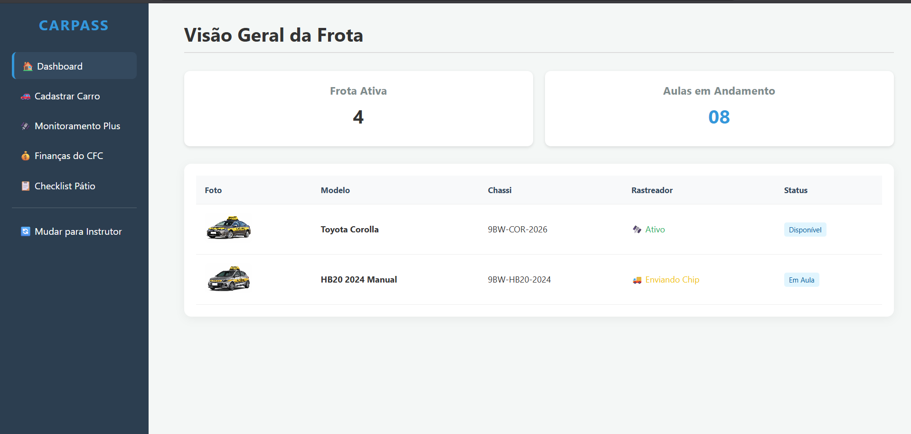
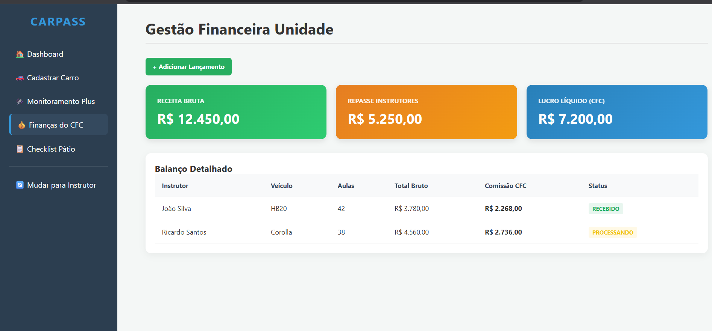

# Carpass - Sistema de Gestão e Alocação para CFCs e Instrutores

O **Carpass** é uma plataforma inovadora que conecta Centros de Formação de Condutores (CFCs) a instrutores independentes, funcionando como um ecossistema de alocação de veículos. Inspirado no modelo de assinaturas, o sistema permite que instrutores utilizem frotas ociosas de CFCs de forma flexível e segura.

---

## 🚀 Funcionalidades Principais

### 🏢 Visão do CFC (Administrativo)
O administrador tem controle total sobre os ativos e a saúde financeira da unidade.

* **Dashboard de Frota:** Visualização rápida da frota ativa e monitoramento de aulas em andamento.

* **Gestão Financeira:** Controle detalhado de receita bruta, repasses para instrutores e lucro líquido da unidade.

* **Cadastro de Veículos (Ficha Técnica):** Interface para registro de dados oficiais.

---

### 📱 Visão do Instrutor (Mobile)
Interface desenhada para ser mobile-first, permitindo a gestão completa das aulas e locações diretamente do smartphone.

* **Marketplace e Agenda:** Autonomia para escolher veículos disponíveis na rede credenciada e gerenciar horários reservados.

* **Checklist Digital de Retirada:** Processo em três etapas (Registros, Avarias e Validação) para garantir a segurança jurídica na locação.

<table style="width: 100%;">
  <tr>
    <td align="center"><b>Passo 1: Registros</b> </td>
    <td align="center"><b>Passo 2: Avarias</b> </td>
    <td align="center"><b>Passo 3: Validação</b> </td>
  </tr>
</table>

---

## ⚡ O Diferencial: Locação Comum vs. Carpass

| Recurso | Locação Comum (Tradicional) | Modelo Carpass |
| :--- | :--- | :--- |
| **Acesso** | Restrito a um único veículo. | Acesso a **toda a rede** de CFCs. |
| **Custo** | Diárias fixas altas. | Planos de assinatura + custo por KM. |
| **Vistoria** | Papel e caneta, lenta. | **Checklist Digital** com fotos no App. |
| **Segurança** | Confiança apenas contratual. | Monitoramento **IoT via hardware (ESP32)**. |

---

## 🛠️ Tecnologias Utilizadas

* **Linguagem:** Python
* **Framework Web:** Flask
* **Front-end:** HTML5, CSS3 (Design responsivo)
* **Banco de Dados:** SQLite
* **Hardware:** Integração com ESP32 e GPS NEO-6M

---

## 👥 Equipe Desenvolvedora
* João Vítor Dacunto Pires
* Miguel Antônio Ramos
* Lucas Eduardo Da Silva
* Felipe Francis Siqueira
* Wagner Florêncio Naves
